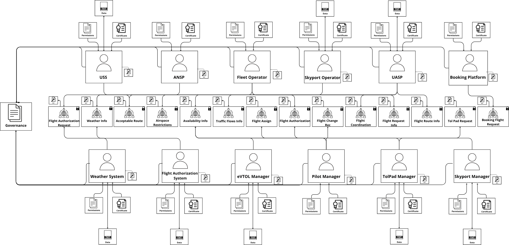

# 🚀 UATM-DDS-SEC: Securing Urban Air Traffic Management with DDS

<br> 

This repository hosts the implementation of a software prototype for an Urban Air Traffic Management (**UATM**) system based on the **Data Distribution Service (DDS)** middleware. The focus of this work is the rigorous application and evaluation of the **DDS Security Specification**.

This code base supports the research presented in the paper: **"Security Challenges and Recommendations For Data Distribution Service On Urban Air Traffic Management Systems"**.

<br> 

## 🛡️ Project Context & Security Focus

This prototype simulates the pre-departure phase of eVTOL (electric Vertical Take-Off and Landing) vehicle operations, acting as a live testbed for threat modeling within a safety-critical domain.

| Aspect | Detail |
| :--- | :--- |
| **Objective** | Simulate secure real-time data exchange among UATM stakeholders (UASP, Fleet Operator, Skyports, etc.). |
| **DDS Middleware** | **OpenDDS**. Chosen for its open-source nature and robust implementation of the DDS Security Specification. |
| **Core Security** | **DDS Security Plugins** enforcing mutual **Authentication (X.509 Certificates)** and fine-grained **Access Control (XML Permissions)** based on the Principle of Least Privilege (**PoLP**). |
| **Methodology Link**| The architecture is derived from a System-Theoretic Process Analysis (**STPA**) and was assessed using **STRIDE** and **DREAD** threat modeling. |
| **Scenario** | Pre-departure workflow (Flight Booking, Resource Assignment, Flight Authorization...). |

<br> 

## 📐 System Architecture (Domain Participants & Topics)

The system is comprised of 12 distinct **Domain Participants (DPs)**, each representing a UATM entity, exchanging data via 17 well-defined **DDS Topics**.

### Key Architectural Model

<p align="center">
   
  <br>
  <em>Figure 1: UATM DDS Security Architecture Model.</em>
</p>

### DDS Entities

The project is structured with one Domain Participant (DP) per critical entity:

| Entity Folder | Description | Role in UATM Scenario |
| :--- | :--- | :--- |
| `uaspManagerDP` | Urban Airspace Service Provider | Manages airspace, grants `FlightAuthorization`. |
| `fleetOperatorDP` | Fleet Operator | Coordinates flights, publishes `FlightCoordination`. |
| `skyportOperatorDP` | Skyport Operator | Manages physical Skyport resources and air traffic. |
| `pilotManagerDP` | Pilot Manager | Manages pilot and flight crew availability. |
| `evtolManagerDP` | eVTOL Manager | Manages eVTOL vehicle availability. |
| `weatherDP` | Weather System | Publishes `WeatherInfo` for flight planning. |
| ... | (Other DPs: ANSP, USS, Booking Platform, etc.) | ... |

<br> 

## ⚙️ Repository Structure

```tree
uatm-dds/
└── pre-departure-scenario/
└── general/
├── {DP_NAME}DP/ # Folders for each of the 12 Domain Participants (C++ code)
├── security/ # CRITICAL: Contains all X.509 certificates and XML policies
├── model/ # IDL files and OpenDDS project definitions
├── docker-compose.yml# Defines and orchestrates the entire multi-process DDS system
├── rtps.ini # OpenDDS RTPS (Real-Time Publish-Subscribe) transport config
└── mwc.pl # OpenDDS configuration script
```

<br> 

## 🛠️ Project Setup with Docker

This project uses **OpenDDS** for distributed communication and provides a Docker-based environment for building and running the system.

### Prerequisites

1. Check that docker and docker-compose are installed.

```bash
docker --version
docker-compose --version
```

2. Install OpenDDS image.

```bash
docker pull ghcr.io/opendds/opendds:latest
```

3. Clone this repository and navigate to the `general` directory within the project.

```bash
git clone https://github.com/giovananog/uatm-dds
cd uatm-dds/pre-departure-scenario/general
```

---

<br> 

### Building the example

1. Enter a container

```bash
docker run --rm -ti -v "$(PWD):/opt/workspace" ghcr.io/opendds/opendds:latest
```

2. Configure and build the example

```bash
source /opt/OpenDDS/setenv.sh
mwc.pl -type gnuace
make
```

3. Exit the container

```bash
exit
```
---

<br>

### Running the example with RTPS

1. Start the environment with Docker Compose:

```bash
docker-compose up
```

You will see a live log output showing discovery, topic data (e.g., weatherInfo, flightAuthorization), and the individual container actions.
